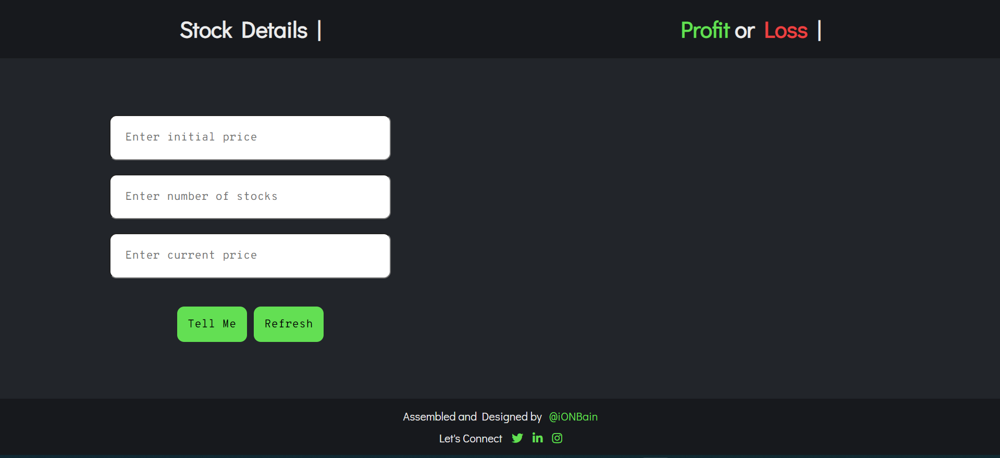
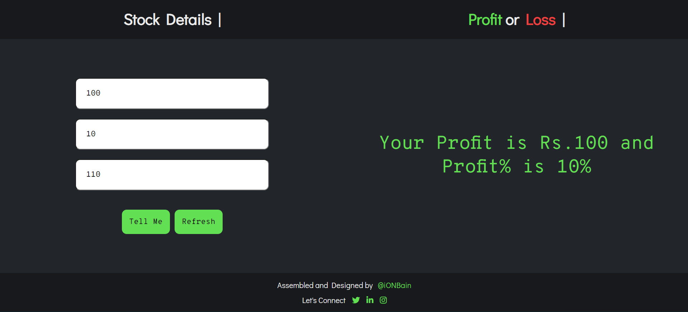
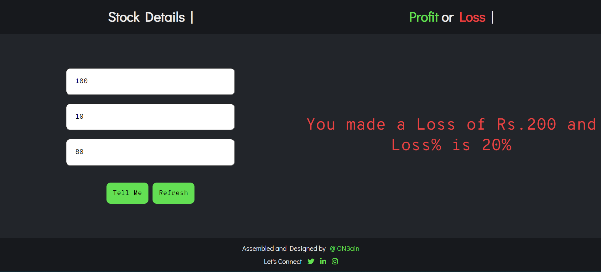
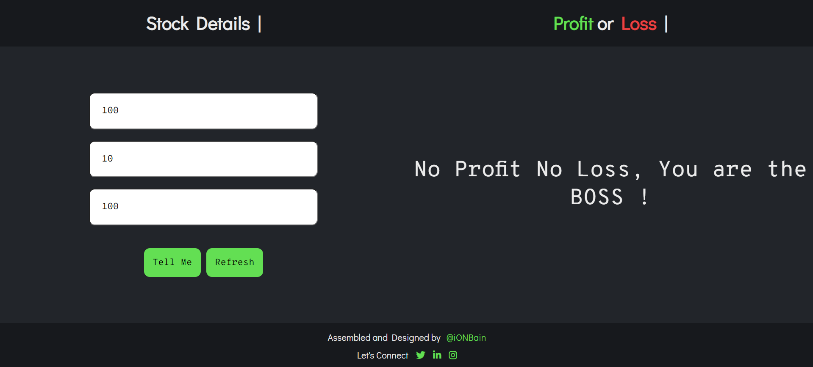

# Stock Profit or Loss Calculator
An app that tells you how much money you made or lost in stock market. 

>Colored outputs are being shared based on "profit" scenario or "loss" scenario or "no profit no loss" scenario

Here are a few project-related insight pictures:

1. Landing Page 

2. Case1: "Profit"- Entering the input details and checking the profit/loss

3. Case2: "Loss"- Entering the input details and checking the profit/loss

4. Case3: "No Profit No Loss"- Entering the input details and checking the profit/loss

> Technologies/Libraries used :-
* Vanilla Javascript
* CSS
* HTML

> Platform used to develop project :-
* [Visual Studio Code](https://code.visualstudio.com/)
> Platform used to host and deploy the project :-
* [Github.com](https://github.com/ionbain)
* [Netlify.com](https://app.netlify.com/teams/bhaskartx/)

